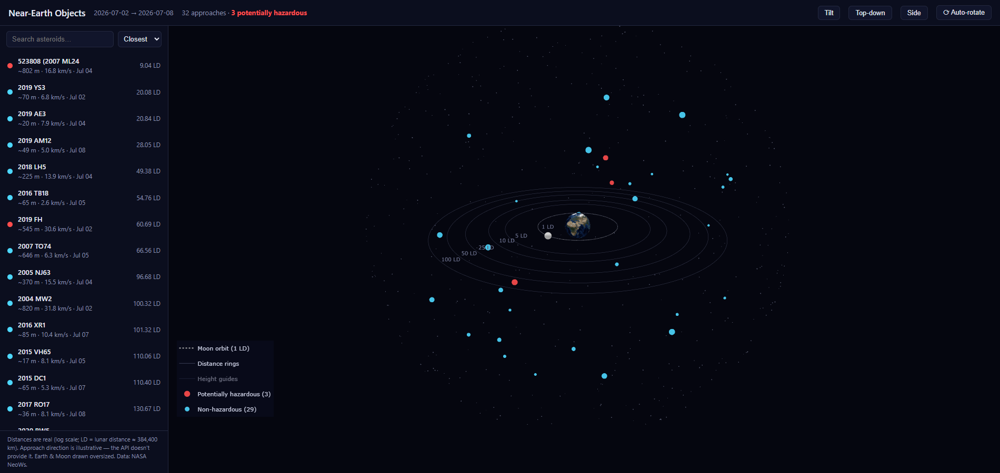

# 🌍 NEO Visualizer

Ever wondered what's flying past Earth *right now*? This thing pulls live
asteroid data from NASA and turns it into a 3D map you can spin around in
your browser.



That's Earth in the middle (actual NASA Blue Marble texture), the Moon
hanging out on its orbit, and every asteroid making a close approach this
week. Red ones are the "potentially hazardous" ones NASA keeps an eye on.
The bigger the dot, the bigger the rock.

## Fire it up

```powershell
python neo_visualizer.py
```

That's it. It grabs the next 7 days of close approaches, prints the
closest ones to your terminal, and pops the map open in your browser.

Want a different week?

```powershell
python neo_visualizer.py --start 2026-07-10 --days 3
```

## Stuff to play with

- **Spin it** — drag to orbit, scroll to zoom. It slowly auto-rotates
  until you grab it (toggle with the ⟳ button).
- **The sidebar** — every asteroid, sorted by whatever you pick (closest /
  largest / soonest), with a search box. Click one and it gets a yellow
  ring in 3D plus a card with all its stats and a link to NASA's JPL orbit
  viewer if you want to go down the rabbit hole.
- **Click a dot** — works the other way too; clicking an asteroid in 3D
  finds it in the list.
- **Camera buttons** — Top-down is basically radar mode. Try it.
- **Legend clicks** — hide the boring asteroids, show only the scary red
  ones, or flip on "Height guides" to see how far above/below the ring
  plane everything sits.

## The fine print (worth knowing)

- Distances are **real** but plotted on a log scale — the rings mark 1, 5,
  10, 25, 50, and 100 lunar distances (1 LD ≈ 384,400 km). Without the log
  scale, a close shave and a distant flyby couldn't share a screen.
- NASA's API tells you *how close* each rock passes but not *from which
  direction*, so the directions here are made up (but stable — same
  asteroid, same spot). Everything else — distance, timing, speed, size,
  hazard flag — is the real deal.
- Earth and the Moon are drawn way oversized. To scale, Earth would be 2
  pixels and you'd see nothing. You're welcome.
- The default `DEMO_KEY` is good for ~30 requests an hour. If you hit the
  limit, grab a free key at https://api.nasa.gov/ (takes a minute) and use
  `--api-key YOUR_KEY` or set the `NASA_API_KEY` env var.
- Needs `requests`, `numpy`, `plotly` — and `pillow` if you want the
  pretty Earth texture (you do).
- The whole map is **one self-contained HTML file**, so you can send
  `neo_map.html` to anyone and it just works, no internet needed.

## Windows quirk

Windows "Controlled Folder Access" blocks Python from saving files into
Documents (and it lies about it — you get a bogus `FileNotFoundError`).
The script detects this and saves to `%LOCALAPPDATA%\neo-visualizer`
instead — watch the console output for where the file went. If you want
output next to the script, allowlist Python from an **admin** PowerShell:

```powershell
Add-MpPreference -ControlledFolderAccessAllowedApplications "C:\Python312\python.exe"
```
